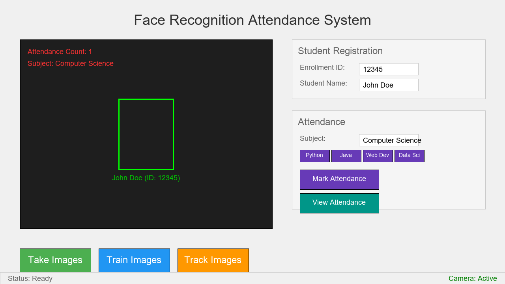

# Face Detection Attendance System

A local-first desktop attendance system built with Python, OpenCV, and CustomTkinter. Automatic attendance uses **YuNet face detection → MiniFAS passive liveness → SFace identity matching → SQLite persistence**. Recognition, liveness, authentication, and attendance data all remain local; no paid recognition or cloud service is required.


<p align="center">
  
</p>

## Production features

- **YuNet + SFace** OpenCV-native face detection, alignment, embeddings, and cosine matching.
- **MiniFASNetV2 + MiniFASNetV1SE liveness** before identity matching.
- **Temporal liveness gate** requiring repeated live frames before automatic attendance is allowed.
- **Single supported Modern UI**. The incomplete Classic/AWS path has been retired.
- **Local authentication with no default password**. First launch creates the administrator interactively.
- **Salted scrypt password storage** with migration of older local plaintext/SHA-256 records after a successful login.
- **SQLite source of truth** with schema migration, foreign keys, WAL, transactions, and duplicate-attendance protection.
- **WAL-safe local backups** using SQLite's online backup API plus config/enrollment state.
- **Resilient cameras** with platform backend fallback and reconnect after repeated failed reads.
- **Verified runtime model downloads** pinned by exact SHA-256 and byte size.
- **Native PyInstaller bundles** for Windows x64, Linux x64, macOS ARM64, and macOS Intel x64.
- **Frozen application self-tests** that import the supported UI/runtime surface instead of checking dependencies only.
- **Tag/version release guard and GitHub artifact attestations** for published native archives.

## Security model

Automatic attendance follows this order:

1. YuNet detects a face.
2. MiniFAS classifies the face crop for common print/screen presentation attacks.
3. A temporal gate requires repeated live results for the same spatial face track.
4. Only then does SFace compute and match the identity embedding.
5. Attendance is stored in SQLite with method `sface+liveness`.

If liveness models are missing or fail verification, automatic attendance fails closed. Manual attendance remains an explicit operator action.

Passive RGB liveness reduces common print/screen attacks, but it is not a certified biometric presentation-attack-detection system and is not equivalent to dedicated IR/depth hardware.

## Installation from source

Requirements:

- Python 3.10, 3.11, or 3.12
- A webcam for enrollment/attendance
- Internet access once for default model downloads, or verified local ONNX model files

```bash
git clone https://github.com/AaryaMody1301/Face_Detection_Attendance_System.git
cd Face_Detection_Attendance_System
python -m venv venv
```

Activate the environment.

Windows:

```bash
venv\Scripts\activate
```

macOS/Linux:

```bash
source venv/bin/activate
```

Install and validate:

```bash
python -m pip install -e .
python scripts/download_face_models.py
python main.py --self-test
python main.py
```

On the first GUI launch, the application asks you to create the first local administrator account. There is **no built-in admin password**.

## Runtime data

Source checkouts use `Data/` by default. Frozen bundles use the operating system's per-user application-data directory:

- Windows: `%LOCALAPPDATA%\AaryaMody1301\FaceDetectionAttendanceSystem`
- macOS: `~/Library/Application Support/FaceDetectionAttendanceSystem`
- Linux: `~/.local/share/FaceDetectionAttendanceSystem`

Override the location with `FACE_ATTENDANCE_DATA_DIR`.

Important generated state:

```text
<application-data>/
├── attendance.db
├── backups/
├── config/
│   ├── config.json
│   └── users.json
├── exports/
├── logs/
├── models/
│   ├── face_gallery.npz
│   ├── opencv_zoo/
│   └── anti_spoof/
└── training_images/
```

Runtime identity, biometric, credential, attendance, and database files are ignored by Git and checked by CI repository-hygiene rules.

## Model files

Models are downloaded at runtime and verified before use:

- YuNet — face detection
- SFace — alignment, embeddings, cosine matching
- MiniFASNetV2 + MiniFASNetV1SE — passive anti-spoofing ensemble

Offline overrides:

- `FACE_YUNET_MODEL`
- `FACE_SFACE_MODEL`
- `FACE_LIVENESS_V2_MODEL`
- `FACE_LIVENESS_V1SE_MODEL`

See [MODEL_LICENSES.md](MODEL_LICENSES.md) for provenance, hashes, and upstream license notes.

## Usage

### Enrollment

1. Open student registration/training.
2. Enter the student ID and name.
3. Capture varied, clear face images.
4. Build/update the SFace gallery.

Legacy LBPH/dlib files are not converted into SFace embeddings; re-enroll when upgrading from those formats.

### Attendance

1. Open Attendance and select a subject.
2. Start the camera.
3. Keep the face clearly visible while the short liveness confirmation completes.
4. Live enrolled faces are matched with SFace and recorded; spoof results are blocked before identity matching.
5. If the camera disconnects, the capture layer attempts to reconnect automatically.

### Command line

Unified CLI:

```bash
python -m src.cli.main --version
python -m src.cli.main train
python -m src.cli.main take "Data Science" --camera 0
python -m src.cli.main view --subject "Data Science" --export
python -m src.cli.main app
```

The direct attendance command also exposes `--threshold`, `--liveness-threshold`, `--liveness-frames`, `--liveness-window`, `--timeout`, and `--late-threshold`.

## Settings and backups

The Modern UI settings page exposes only supported production controls:

- appearance mode
- camera ID/test
- SFace cosine threshold
- MiniFAS live threshold
- temporal live-frame requirement
- local backup creation/retention cleanup

Backups use SQLite's backup API and include the current config, SFace/model state, and enrollment images when present.

## Diagnostics and performance

Headless environment report:

```bash
python main.py --diagnostics
```

Full production import check without opening a GUI:

```bash
python main.py --self-test
```

Real-camera benchmark:

```bash
python scripts/benchmark_pipeline.py --camera 0 --frames 120 --warmup 10
```

Use the benchmark and consented validation subjects to calibrate recognition/liveness thresholds on the actual deployment cameras and lighting.

## Development

```bash
python -m pip install -e ".[dev]"
python main.py --self-test
python scripts/check_repository_hygiene.py
python -m ruff check main.py scripts src tests
python -m pytest -q
```

CI runs source tests on Python 3.10 and 3.12, then builds and smoke-tests frozen bundles on:

- Linux x64
- Windows x64
- macOS ARM64
- macOS Intel x64

## Desktop releases

The release workflow lives at `.github/workflows/release.yml`. A release tag must exactly match the installed package version; for version 1.5.0 the tag is `v1.5.0`.

Each native job builds the one-folder application, runs the frozen production self-test, archives the bundle, and—on tagged releases—creates a GitHub artifact attestation. GitHub Release publication occurs only after all native jobs succeed.

Verify a downloaded archive:

```bash
gh attestation verify <archive> -R AaryaMody1301/Face_Detection_Attendance_System
```

Before publishing the first release, complete [docs/RELEASE_CHECKLIST.md](docs/RELEASE_CHECKLIST.md), including real-camera and threshold validation.

Windows Authenticode signing, Apple Developer ID signing/notarization, MSI installers, and DMG installers are not currently provided because they require external certificate/account infrastructure. The source application and unsigned native bundles remain usable without them.

## Privacy

See [docs/PRIVACY.md](docs/PRIVACY.md). Face images, embeddings, attendance records, and local user credentials are runtime data and must never be committed to the repository.

## License

Application source code is licensed under the MIT License. Runtime model files retain their upstream licenses; see [MODEL_LICENSES.md](MODEL_LICENSES.md).

## Acknowledgements

- OpenCV and OpenCV Zoo for YuNet and SFace
- Minivision AI's Silent-Face-Anti-Spoofing work
- yakhyo/face-anti-spoofing for lightweight ONNX MiniFAS exports
- CustomTkinter for desktop UI components
